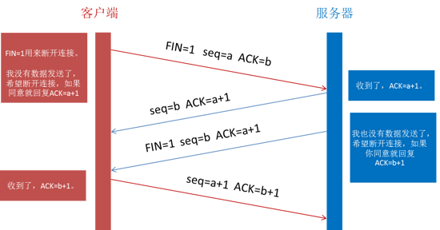
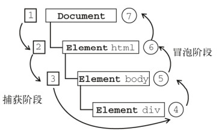

## 1. http & https
https加密

## 2.tcp三次握手


## 3. TCP UDP区别


TCP|UDP
---|---|
面向连接|无连接，即时
1对1|1对多
可靠|不可靠

## 4. Websocket

1. 什么是WebSocket?
WebSocket是HTML5中的协议，支持持久连续，http协议不支持持久性连接。Http1.0和HTTP1.1都不支持持久性的链接，HTTP1.1中的keep-alive，将多个http请求合并为1个

2. WebSocket是什么样的协议，具体有什么优点？
HTTP的生命周期通过Request来界定，也就是Request一个Response，那么在Http1.0协议中，这次Http请求就结束了。在Http1.1中进行了改进，是的有一个connection：Keep-alive，也就是说，在一个Http连接中，可以发送多个Request，接收多个Response。但是必须记住，在Http中一个Request只能对应有一个Response，而且这个Response是被动的，不能主动发起。

WebSocket是基于Http协议的，或者说借用了Http协议来完成一部分握手，在握手阶段与Http是相同的。我们来看一个websocket握手协议的实现，基本是2个属性，upgrade，connection。


## 5. Http请求方式
get,post,put,delete
head：类似于get请求，只不过返回的响应中没有具体的内容，用户获取报头
options：允许客户端查看服务器的性能，比如说服务器支持的请求方式等等。

## 6.  几个很实用的BOM属性对象方法?


什么是Bom? Bom是浏览器对象。有哪些常用的Bom属性呢？
1. location对象

location.href-- 返回或设置当前文档的URL
location.search -- 返回URL中的查询字符串部分。例如 http://www.dreamdu.com/dreamdu.php?id=5&name=dreamdu 返回包括(?)后面的内容?id=5&name=dreamdu
location.hash -- 返回URL#后面的内容，如果没有#，返回空
location.host -- 返回URL中的域名部分，例如www.dreamdu.com
location.hostname -- 返回URL中的主域名部分，例如dreamdu.com
location.pathname -- 返回URL的域名后的部分。例如 http://www.dreamdu.com/xhtml/ 返回/xhtml/
location.port -- 返回URL中的端口部分。例如 http://www.dreamdu.com:8080/xhtml/ 返回8080
location.protocol -- 返回URL中的协议部分。例如 http://www.dreamdu.com:8080/xhtml/ 返回(//)前面的内容http:
location.assign -- 设置当前文档的URL
location.replace() -- 设置当前文档的URL，并且在history对象的地址列表中移除这个URL location.replace(url);
location.reload() -- 重载当前页面

2. history对象

history.go() -- 前进或后退指定的页面数 history.go(num);
history.back() -- 后退一页
history.forward() -- 前进一页

3. Navigator对象

navigator.userAgent -- 返回用户代理头的字符串表示(就是包括浏览器版本信息等的字符串)
navigator.cookieEnabled -- 返回浏览器是否支持(启用)cookie

## 7. http2.0

简要概括：http2.0是基于1999年发布的http1.0之后的首次更新。
提升访问速度（可以对于，请求资源所需时间更少，访问速度更快，相比http1.0）

* 允许多路复用：
  多路复用允许同时通过单一的HTTP/2连接发送多重请求-响应信息。改善了：在http1.1中，浏览器客户端在同一时间，针对同一域名下的请求有一定数量限制（连接数量），超过限制会被阻塞。

* 二进制分帧：HTTP2.0会将所有的传输信息分割为更小的信息或者帧，并对他们进行二进制编码

* 首部压缩

* 服务器端推送


## 8. Cookie、sessionStorage、localStorage的区别
共同点：都是保存在浏览器端，并且是同源的

Cookie|localStorage|sessionStorage
---|---|---
服务器和浏览器来回|不会把数据发送给服务器，只本地保存
会过期|永久保存|仅仅在当前页面未关闭时有效


补充说明一下cookie的作用：
  * 保存用户登录状态。例如将用户id存储于一个cookie内，这样当用户下次访问该页面时就不需要重新登录了，现在很多论坛和社区都提供这样的功能。 cookie还可以设置过期时间，当超过时间期限后，cookie就会自动消失。因此，系统往往可以提示用户保持登录状态的时间：常见选项有一个月、三个 月、一年等。
  * 跟踪用户行为。例如一个天气预报网站，能够根据用户选择的地区显示当地的天气情况。如果每次都需要选择所在地是烦琐的，当利用了cookie后就会显得很人性化了，系统能够记住上一次访问的地区，当下次再打开该页面时，它就会自动显示上次用户所在地区的天气情况。因为一切都是在后 台完成，所以这样的页面就像为某个用户所定制的一样，使用起来非常方便定制页面。如果网站提供了换肤或更换布局的功能，那么可以使用cookie来记录用户的选项，例如：背景色、分辨率等。当用户下次访问时，仍然可以保存上一次访问的界面风格。


  
## 9.  Doctype作用?严格模式与混杂模式如何区分？它们有何意义?
Doctype声明于文档最前面，告诉浏览器以何种方式来渲染页面，这里有两种模式，严格模式和混杂模式。

* 严格模式的排版和JS 运作模式是 以该浏览器支持的最高标准运行。

* 混杂模式，向后兼容，模拟老式浏览器，防止浏览器无法兼容页面。


## 10. 讲讲viewport和移动端布局
响应式布局，mediaquery, rem, 百分比


## 11. Cookie, Session区别

Cookie|Session
---|---|
数据存放在浏览器上|数据存放在服务器上
不安全|安全
数据量小，但不耗费服务器|耗费服务器


## 12.浏览器缓存

缓存分为两种：强缓存和协商缓存，根据响应的header内容来决定。
强缓存相关字段有expires，cache-control。
* Expires是一个绝对时间，即服务器时间。浏览器检查当前时间，如果还没到失效时间就直接使用缓存文件。但是该方法存在一个问题：服务器时间与客户端时间可能不一致。因此该字段已经很少使用。
* cache-control中的max-age保存一个相对时间。例如Cache-Control: max-age = 484200，表示浏览器收到文件后，缓存在484200s内均有效。 如果同时存在cache-control和Expires，浏览器总是优先使用cache-control。

协商缓存相关字段有Last-Modified/If-Modified-Since，Etag/If-None-Match

* last-modified是第一次请求资源时，服务器返回的字段，表示最后一次更新的时间。下一次浏览器请求资源时就发送if-modified-since字段。服务器用本地Last-modified时间与if-modified-since时间比较，如果不一致则认为缓存已过期并返回新资源给浏览器；如果时间一致则发送304状态码，让浏览器继续使用缓存。

* Etag：资源的实体标识（哈希字符串），当资源内容更新时，Etag会改变。服务器会判断Etag是否发生变化，如果变化则返回新资源，否则返回304。


## 13. 输入一个url，到这个页面呈现出来，中间发生了什么
输入url后，首先需要找到这个url域名的服务器ip,为了寻找这个ip，浏览器首先会寻找缓存，查看缓存中是否有记录，缓存的查找记录为：浏览器缓存-》系统缓存-》路由器缓存，缓存中没有则查找系统的hosts文件中是否有记录，如果没有则查询DNS服务器，得到服务器的ip地址后，浏览器根据这个ip以及相应的端口号，构造一个http请求，这个请求报文会包括这次请求的信息，主要是请求方法，请求说明和请求附带的数据，并将这个http请求封装在一个tcp包中，这个tcp包会依次经过传输层，网络层，数据链路层，物理层到达服务器，服务器解析这个请求来作出响应，返回相应的html给浏览器，因为html是一个树形结构，浏览器根据这个html来构建DOM树，在dom树的构建过程中如果遇到JS脚本和外部JS连接，则会停止构建DOM树来执行和下载相应的代码，这会造成阻塞，这就是为什么推荐JS代码应该放在html代码的后面，之后根据外部央视，内部央视，内联样式构建一个CSS对象模型树CSSOM树，构建完成后和DOM树合并为渲染树，这里主要做的是排除非视觉节点，比如script，meta标签和排除display为none的节点，之后进行布局，布局主要是确定各个元素的位置和尺寸，之后是渲染页面，因为html文件中会含有图片，视频，音频等资源，在解析DOM的过程中，遇到这些都会进行并行下载，浏览器对每个域的并行下载数量有一定的限制，一般是4-6个，当然在这些所有的请求中我们还需要关注的就是缓存，缓存一般通过Cache-Control、Last-Modify、Expires等首部字段控制。 Cache-Control和Expires的区别在于Cache-Control使用相对时间，Expires使用的是基于服务器 端的绝对时间，因为存在时差问题，一般采用Cache-Control，在请求这些有设置了缓存的数据时，会先 查看是否过期，如果没有过期则直接使用本地缓存，过期则请求并在服务器校验文件是否修改，如果上一次 响应设置了ETag值会在这次请求的时候作为If-None-Match的值交给服务器校验，如果一致，继续校验 Last-Modified，没有设置ETag则直接验证Last-Modified，再决定是否返回304


1. 浏览器的地址栏输入URL并按下回车。

2. 浏览器查找当前URL是否存在缓存，并比较缓存是否过期。

3. DNS解析URL对应的IP。
   1. 如果本地hosts文件有网址的映射关系，则调用
    2. 若没有，则使用DNS服务器解析。
4. 根据IP建立TCP连接（三次握手）。
   1. 第一次握手： 建立连接时，客户端发送syn包（syn=j）到服务器，并进入SYN_SENT状态，等待服务器确认； 
   2. 第二次握手： 服务器收到syn包，必须确认客户的SYN（ack=j+1），同时自己也发送一个SYN包（syn=k），即SYN+ACK包，此时服务器进入SYN_RECV状态；
    3. 第三次握手： 客户端收到服务器的SYN+ACK包，向服务器发送确认包ACK(ack=k+1），此包发送完毕，客户端和服务器进入ESTABLISHED（TCP连接成功）状态，完成三次握手。


5. HTTP发起请求。
完整的HTTP请求包含请求起始行、请求头部、请求主体三部分。
6. 服务器处理请求，浏览器接收HTTP响应。
服务器在收到浏览器发送的HTTP请求之后，会将收到的HTTP报文封装成HTTP的Request对象，并通过不同的Web服务器进行处理，处理完的结果以HTTP的Response对象返回，主要包括状态码，响应头，响应报文三个部分.
7. 渲染页面，构建DOM树。
   在浏览器还没接收到完整的 HTML 文件时，它就开始渲染页面了，在遇到外部链入的脚本标签或样式标签或图片时，会再次发送 HTTP 请求重复上述的步骤。在收到 CSS 文件后会对已经渲染的页面重新渲染，加入它们应有的样式，图片文件加载完立刻显示在相应位置。在这一过程中可能会触发页面的重绘或重排。这里就涉及了两个重要概念：Reflow和Repaint。
　　Reflow，也称作Layout，中文叫回流，一般意味着元素的内容、结构、位置或尺寸发生了变化，需要重新计算样式和渲染树，这个过程称为Reflow。
　　Repaint，中文重绘，意味着元素发生的改变只是影响了元素的一些外观之类的时候（例如，背景色，边框颜色，文字颜色等），此时只需要应用新样式绘制这个元素就OK了，这个过程称为Repaint。

8. 关闭TCP连接（四次挥手)
   

  * 第一次挥手是浏览器发完数据后，发送FIN请求断开连接。

  * 第二次挥手是服务器发送ACK表示同意，如果在这一次服务器也发送FIN请求断开连接似乎也没有不妥，但考虑到服务器可能还有数据要发送，所以服务器发送FIN应该放在第三次挥手中。

* 这样浏览器需要返回ACK表示同意，也就是第四次挥手。


## 14. HTTP2.0 的特性

http2.0的特性如下：
1. 内容安全，应为http2.0是基于https的，天然具有安全特性，通过http2.0的特性可以避免单纯使用https的性能下降

2. 二进制格式，http1.X的解析是基于文本的，http2.0将所有的传输信息分割为更小的消息和帧，并对他们采用二进制格式编码，基于二进制可以让协议有更多的扩展性，比如引入了帧来传输数据和指令

3. 多路复用，这个功能相当于是长连接的增强，每个request请求可以随机的混杂在一起，接收方可以根据request的id将request再归属到各自不同的服务端请求里面，另外多路复用中也支持了流的优先级，允许客户端告诉服务器那些内容是更优先级的资源，可以优先传输，


## 15. 浏览器在生成页面的时候，会生成那两颗树？

构造两棵树，DOM树和CSSOM规则树
当浏览器接收到服务器相应来的HTML文档后，会遍历文档节点，生成DOM树，

CSSOM规则树由浏览器解析CSS文件生成，


____
## 1.  BFC（块级格式化上下文，用于清楚浮动，防止margin重叠等）
直译成：块级格式化上下文，是一个独立的渲染区域，并且有一定的布局规则。
BFC区域不会与float box重叠

BFC是页面上的一个独立容器，子元素不会影响到外面

计算BFC的高度时，浮动元素也会参与计算

那些元素会生成BFC：

根元素

float不为none的元素

position为fixed和absolute的元素

display为inline-block、table-cell、table-caption，flex，inline-flex的元素

overflow不为visible的元素

## 2.visibility=hidden, opacity=0，display:none
||`opacity = 0`|`visibility = hidden`| `display: none`
|---|---|---|---|
改变页面布局|no|no|yes
可触发事件|yes|no|no


## 3. 水平居中，垂直居中
1. margin 0 auto
2. position: absolute; left: 50%; top: 50%;
3. transform: translate(-50%,-50%);
4. display: flex, align-items: center; justify-content: center


___
## 1. JS类的创建和继承
类的创建
```javascript
//其实就是声明一个constructor
function Animal (name) {
// 属性
  this.name = name || 'Animal';
// 实例方法
  this.sleep = function(){
    console.log(this.name + '正在睡觉！');
  }
}

// 原型方法
Animal.prototype.eat = function(food) {
console.log(this.name + '正在吃：' + food);
};
```


原型链继承
```javascript
//其实就是声明一个constructor
function Cat(){ }
Cat.prototype = new Animal();
Cat.prototype.name = 'cat';
//　Test Code
var cat = new Cat();
console.log(cat.name);
console.log(cat.eat('fish'));
console.log(cat.sleep());
console.log(cat instanceof Animal); //true
console.log(cat instanceof Cat); //true
};
```

构造继承
```javascript
function Cat(name){
  Animal.call(this);
  this.name = name || 'Tom';
}
// Test Code
var cat = new Cat();
console.log(cat.name);
console.log(cat.sleep());
console.log(cat instanceof Animal); // false
console.log(cat instanceof Cat); // true

```

组合继承
```javascript
function Cat(name){
  Animal.call(this);
  this.name = name || 'Tom';
}
Cat.prototype = new Animal();
Cat.prototype.constructor = Cat;
// Test Code
var cat = new Cat();
console.log(cat.name);
console.log(cat.sleep());
console.log(cat instanceof Animal); // true
console.log(cat instanceof Cat); // true
```


寄生组合继承
```javascript
var Super = function(){};//创建一个没有实方法的类
Super.prototype = Animal.prototype;
Cat.prototype = new Super();//将实例作为子类的原型
```


## 2. 事件流
1. 冒泡　IE的事件流叫做事件冒泡(event bubbling)，即事件开始时由最具体的元素(文档中嵌套层次最深的那个节点)接收，然后逐级向上传播到较为不具体的节点(文档)
2. 捕获
 事件捕获的思想是不太具体的节点应该更早接收到事件，而最具体的节点应该最后接收到事件。事件捕获的用意在于在事件到达预定目标之前就捕获它

 